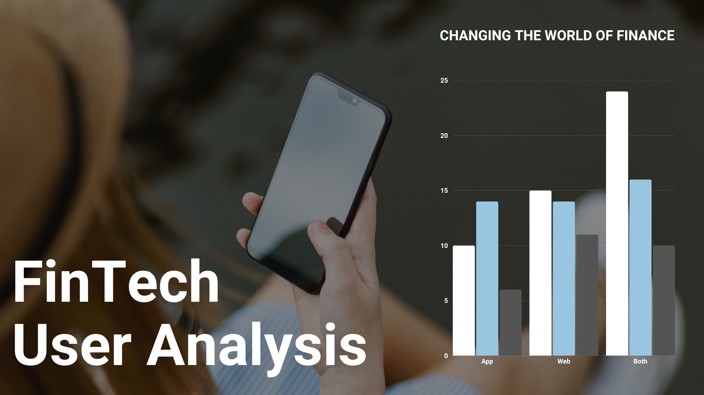
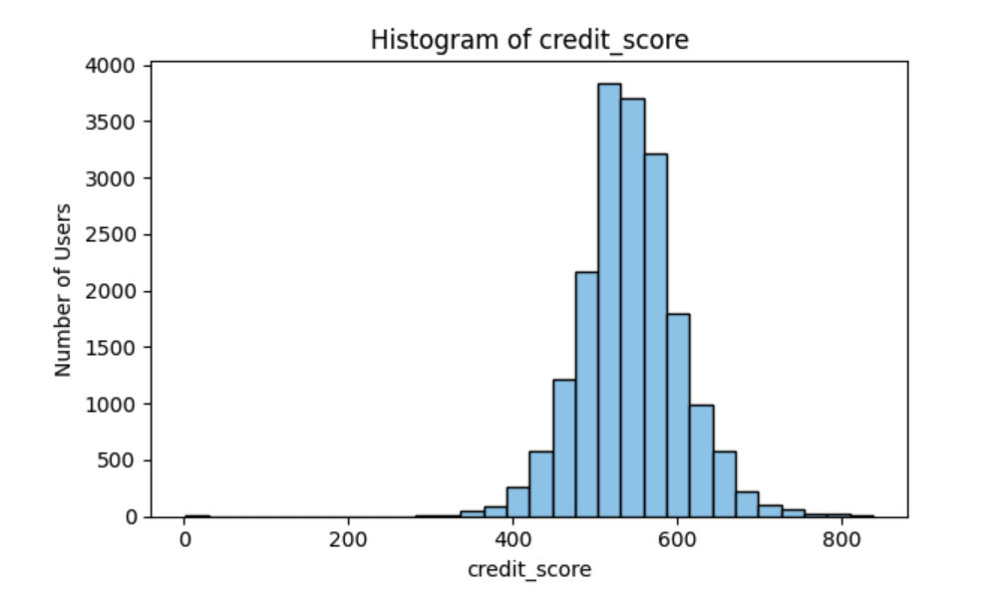
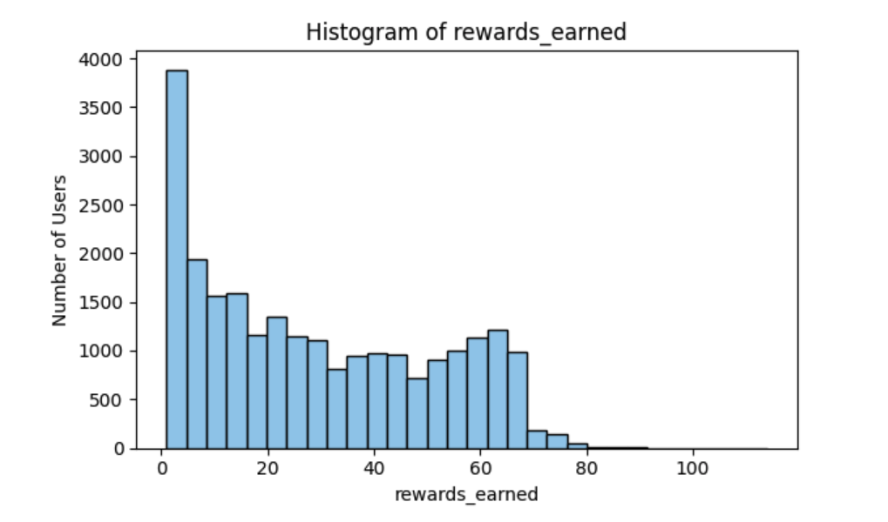

# FinTech-User-Analytics
Comprehensive fintech user analytics: Insights, segmentation, profiling, and predictive risk modelling.

## Table of Content 
- [Project Overview](#project-overview)
- [Business Context & Problem Statement](#business-context--problem-statement)
- [Objectives](#objectives)
- [Hypotheses](#hypotheses)
- [Dataset](#dataset)
- [Project Structure](#project-structure)
- [How To Use This Project](#how-to-use-this-project)
- [Methodology](#methodology)
- [Machine Learning Approach](#machine-learning-approach)
- [Visualisation](#visualisation)
- [Key Findings & Insights](#key-findings--insights)
- [Future Improvements](#future-improvements)
- [Learning Outcomes & Reflection](#learning-outcomes--reflection)
- [Ethical Considerations](#ethical-considerations)
- [Technologies Used](#technologies-used)
- [Credits](#credits)
- [Acknowledgement](#acknowledgement)

## Project Overview

FinTech User Analytics is an end-to-end data solution designed to uncover behavioural and engagement insights from simulated fintech user data. This project identifies churn patterns, product adoption drivers (such as credit card interest), and engagement trends across mobile platforms. By leveraging data on user activity, financial behaviour, and platform preferences, it provides business-ready insights and predictive models to support decision-making in customer retention, product personalisation, and digital experience optimisation.

## Business Context & Problem Statement

In today’s fast-moving fintech landscape, companies face intense competition for user acquisition and retention. Understanding how users interact with financial products and digital platforms is essential for building loyalty, increasing engagement, and driving sustainable growth. Modern fintech platforms must analyse behavioural trends and engagement patterns to:
 * Reduce customer acquisition costs
 * Improve user retention and lifetime value
 * Optimise product features and offerings
 * Personalise the user experience across channels
 * Mitigate risk through behavioural and financial profiling

This project leverages simulated fintech user data to:
 * Detect and predict churn behaviour
 * Drive adoption of financial products (e.g., credit cards, loans)
 * Tailor engagement strategies across mobile and web users
 * Analyse the impact of referrals, rewards, and app usage
 * Segment users for targeted outreach and product recommendations

Solution:
This project delivers an interactive analytics platform that analyses user behaviour, financial engagement, and product adoption trends. Through visualisations and machine learning models, it surfaces actionable insights for business strategy and operational decision-making.

## Objectives

 * Segment fintech users based on demographic, behavioural, and financial attributes to uncover distinct user personas
 * Identify high-risk churn segments and high-value loyal users using engagement and transaction data
 * Analyse key drivers of loyalty, including app usage patterns, referral behaviour, and reward incentives
 * Predict user retention likelihood to support targeted marketing and feature personalisation strategies
 * Provide actionable insights for product teams to optimise onboarding, referral flows, and feature adoption
 * Visualise engagement and loyalty trends via interactive dashboards for strategic business decision-making

 ## Hypotheses

FinTech users can be segmented into distinct personas based on behavioural patterns. These personas display significantly different levels of engagement, retention, and financial value, making them actionable for business strategy.
This project investigates whether distinct FinTech user behaviours can be used to classify users into personas that help explain differences in engagement, churn, and product interest. 
These insights can be used by fintech platforms to inform product design, marketing, and retention strategies.

**Key Hypotheses**:
 1. Users who earn higher rewards are less likely to churn. 

     **Validation:**  Compare churn rates across reward levels using visual analytics and churn prediction models (e.g., logistic regression or decision trees).

2. Users referred by others show stronger retention and greater interest in financial products.

    **Validation:** Segment referred vs. non-referred users and evaluate retention indicators, product uptake (e.g., credit card interest), and average engagement scores.

3. App users (especially on mobile) demonstrate higher engagement than web-only users.

    **Validation:** Analyse engagement metrics across different user types (app_user, web_user, ios_user, android_user) using clustering and descriptive comparison.

## Dataset
The Fintech Users dataset contains behavioural and demographic data for 27,000 fintech application users, designed for customer churn analysis and user behaviour modelling.

 * **Source**: [Kaggle - Fintech Users Data](https://www.kaggle.com/datasets/niketdheeryan/fintech-users-data)
 * **Records**: 27,000 users
 * **Features**: 31 variables (24 integer, 4 float, 3 categorical)

## Project Structure

<pre>📦 FinTech_User_Analytics
├── 📁 Data
│    └── 📁 Cleaned
│        └── 📄 cleaned_data.csv 
│    └── 📁 Raw
│        └── 📄 Fintech_user.csv                   
├── 📁 Notebooks
│   ├── 📄 01_initial_inspection.ipynb         
│   ├── 📄 02_data_cleaning.ipynb            
│   ├── 📄 03_hypothesis_testing.ipynb 
│   └── 📄 04_machine_learning.ipynb         
├── 📁 Images
├── 📄 .gitignore                              # Specifies files/folders Git should ignore
├── 📄 README.md                               # Project overview
└── 📄 requirements.txt                        # Dependencies
</pre>

## How To Use This Project

This project is designed to be accessible and valuable for a range of users:

**For Business Users**

 * **Goal:** Understand key user segments and what drives engagement, churn, and product adoption.
 * **How to Use:** Explore the Tableau dashboard to view KPIs, user persona rankings, and loyalty trends.
 * **Value:** Support strategic decisions on product offerings, referral systems, and retention campaigns.

**For Product Teams**

 * **Goal:** Identify high-value user behaviours and optimise onboarding or referral flows.
 * **How to Use:** Use the dashboard filters to analyse app vs. web users, platform preferences (iOS/Android), and referral impacts.
 * **Value:** Improve user experience and product-market fit based on behavioural insights.

**For Analysts**

 * **Goal:** Dive deep into behavioural data and modelling logic.
 * **How to Use:** Navigate the notebooks/folder to follow data preparation, feature engineering, and ML development steps.
 * **Value:** Extend the analysis or apply the framework to new fintech user datasets.

## Methodology

This project follows a structured data science approach to extract user insights, build behavioural profiles, and identify key engagement patterns within a fintech platform.

 * **Data Collection & Preparation**: Imported the dataset, handled missing values, and cleaned data for consistency.

 * **Exploratory Data Analysis (EDA)**: Investigated distributions of key variables and relationships between user demographics, behaviour, and engagement.

 * **Machine Learning**: Built and evaluated predictive models, including logistic regression and random forest classifiers, to estimate customer churn. Model performance was assessed using precision, recall, and F1-score metrics. 

 * **Visualisation**: Developed an interactive dashboard to present insights tailored for business and product stakeholders.

## Machine Learning Approach

This phase of the project focused on developing and evaluating predictive models to estimate churn probability and uncover key behavioural drivers of churn.

Multiple algorithms were tested, including:

- **Logistic Regression** – as a baseline model  
- **Random Forest Classifier** – to capture non-linear patterns and gain feature importance insights

### Key Techniques Used
- **Feature Engineering**: Selected behavioural and demographic variables relevant to churn  
- **One-Hot Encoding**: Transformed categorical variables for model compatibility  
- **Standardisation**: Applied to numerical features (e.g., age, credit score)  
- **Train/Test Split with Stratification**: Ensured class distribution consistency  
- **Class Imbalance Handling**: Used `class_weight='balanced'` to improve recall on minority class  
- **Model Evaluation**: Precision, recall, F1-score, and accuracy used for comparison

### Results Summary
- **Random Forest** performed better than logistic regression across all key metrics  
- The model identified the following as the **top predictors of churn**:
  - `age`
  - `credit_score`
  - `reward_rate`
  - `rewards_earned`

These findings highlight the strong influence of customer financial behaviour and engagement with the rewards system.

Future work will include model tuning, dashboard integration, and real-time churn scoring.

## Visualisation

This project incorporates both exploratory visualisations in Python notebooks and an interactive Tableau dashboard to gain insights into user behaviour and engagement.

### Notebook Visualisations
To understand the distribution and variability of key numerical features, the following plots were created:

 * Histograms for:
    * `age`
    * `credit_score`
    * `deposits`
    * `withdrawal`
    * `rewards_earned`
    * `reward_rate`

These histograms help visualise the spread and skewness of each variable, allowing for identification of trends, outliers, and anomalies.

 * Boxplots for:
     * `credit_score`
     * `rewards_earned`

These were used to detect outliers and examine the central tendency and spread of the values, offering insight into potential data quality issues or irregular user behaviour.

### Tableau Dashboard

An interactive dashboard was created using Tableau to explore key performance indicators and user segmentation. The dashboard includes:

 * **Core KPIs**: Highlights of overall performance metrics such as average churn rate, engagement scores, and referral effectiveness.
 * **User Clusters**: Segmentation of users based on behavioural patterns to identify high-risk or high-value profiles.
 * **Churn Analysis**:
    * Churn rate segmented by platform usage
    * Average churn rate by referral status
* **Engagement Score**: Visualised by cluster and filters, providing insight into how user types interact with the platform.

**Interactive Filters**:
 * Age group
 * Referral status (Referred / Not Referred)
 * Platform (iOS, Andriod)

These filters allow stakeholders to explore specific user cohorts and assess targeted behaviours. 

**Known Issue with Reset Functionality**:

The `Reset All Filters` button is designed to return all filters to their default states, restoring the full dataset view across all KPIs and charts. However, the button does not consistently reset all filters and some charts may remain filtered after use. This will be addressed in an upcoming fix.

[Click here to access the Tableau Dashboard](https://public.tableau.com/app/profile/ivy.kepiro/viz/FinTechUser/Dashboard1) 

## Key Findings & Insights

Analysis of 24,741 fintech users reveals critical patterns affecting customer retention and engagement. With an overall churn rate of 42.1%, the platform faces significant retention challenges, but targeted interventions based on rewards, referrals, and mobile engagement show promising opportunities for improvement.

1. **Rewards Programs Drive Loyalty**  
   Users earning higher rewards show significantly better retention:

   - **Retained users** earn a median of **26.00 points**
   - **Churned users** earn a median of **15.00 points**

2. **Referral Programs Excel at Retention**  
   Referred users demonstrate superior retention performance:

   - **Referred users**: 35.9% churn rate  
   - **Non-referred users**: 45.0% churn rate  
   - **20%** relative improvement in retention through referrals  

3. **Mobile-First Strategy Critical for Engagement**  
   App users show dramatically higher engagement:

   - **App users**: 39.10 average engagement score  
   - **Web-only users**: 0.01 average engagement score  

4. **Platform Usage Patterns**  
   Insights into cross-platform behaviour and adoption:

   - **95.3%** app adoption rate shows strong mobile preference  
   - **60.6%** web usage indicates multi-channel behaviour  
   - **Cross-platform users** likely represent the highest-value segment  

Combining usage behaviour with demographic and reward features led to better churn classification results.

## Future Improvements

- **Advanced Model Tuning**: Explore additional algorithms such as XGBoost and fine-tune hyperparameters to improve churn prediction performance.
- **Feature Engineering**: Create richer behavioural and temporal features to boost model accuracy.
- **A/B Testing Design**: Propose experiments to validate the impact of rewards or referral systems on churn reduction.
- **Enhanced Dashboarding**: Improve dashboard interactivity and performance with user-driven filters, cohort tracking, and retention funnel views.
- **Model Deployment**: Develop a pipeline to serve predictive models and dashboards in a production or near-real-time environment.

## Learning Outcomes and Reflection

### Capstone Learning Objectives Checklist
1. **Statistical Foundation** – Applied core statistical concepts (mean, median, hypothesis testing) and conduct statistical tests (t-tests, Chi-square) to validate business hypotheses using fintech user data.
2. **Technical Implementation and Visualisation** – Used Python libraries like Pandas, Matplotlib, Seaborn, and Plotly, I performed robust data cleaning, transformation, and visualisation.   
3. **End-to-End Analytical Workflow** – Executed complete data analysis from cleaning to insights, justifying methodological choices and documenting systematic analytical approaches for business stakeholders.   
4. **Integration of AI Tools** – Integrated variety of AI tools for code optimization and insight generation. 
5. **Data Management & Version Control** – Implement version control, structured data storage, and documentation standards.  
6. **Ethical Considerations** – Addressed ethical considerations.
7. **Project Organisation** – Organised structured analytics projects with professional documentation, applying appropriate research methodologies aligned with business objectives.
8. **Communication & Visualisation** – Created interactive visualisations to clearly communicate complex insights to varied audiences.
9. **Industry Application** – Applied analytics to solve fintech challenges (churn, engagement, product adoption) and propose data-driven business recommendations.
10. **Future Planning** – Developed scalable project plans for ongoing analytics initiatives.
11. **Continuous Learning** – Experiment with new analytical tools, reflect on learning progress, and identify knowledge gaps with plans for continued professional development.

### Personal Reflection
This capstone project has been a valuable opportunity to apply analytical skills to a real-world problem. 
One area I found particularly challenging was developing a dashboard that is not only functional but also visually appealing and intuitive. I realised that creating a compelling user experience takes more time and design consideration than expected, especially when balancing clarity, interactivity, and aesthetics. Although I started with a clear project plan, I learned the importance of staying adaptable. As the project progressed, some assumptions changed, whether due to data limitations or evolving goals, which required me to adjust my approach. Moving forward, I aim to improve my design and UI skills to create dashboards that communicate insights more powerfully. I also plan to continue refining my ability to adapt project plans in real-time, while maintaining focus on the core objectives.

## Ethical Considerations
The data used is publicly available and does not contain any personal or private information. In a real-world scenario, strict adherence to data privacy regulations (e.g., GDPR, CCPA) would be essential, ensuring client data is protected and used only for its intended purpose.
Additionally, we must consider the potential for algorithmic bias in churn prediction models, which could lead to discriminatory treatment of certain customer segments. Model fairness across demographic groups will be evaluated, and transparency in decision-making processes will be maintained to ensure ethical deployment of any predictive insights.

## Technologies Used

### Data Analysis & Manipulation
- **Pandas** – for data preparation, cleaning, and transformation tasks.
- **NumPy** – for numerical operations and array manipulation.
- **Jupyter Notebook** – for interactive coding, documentation, and visual output.

### Data Visualisation
- **Matplotlib** – for basic plotting and custom visualisations during exploratory data analysis (EDA).
- **Seaborn** – for statistical data visualisations such as correlation heatmaps and boxplots.
- **Plotly** – for interactive and dynamic chart.
- **Tableau** – for building high-level interactive dashboard.

### Machine Learning & Modelling
- **Scikit-Learn** – for model building, preprocessing, feature selection, cross-validation, and evaluation.
- **SciPy** – for statistical hypothesis testing (e.g., Mann–Whitney U test, t-tests, chi-square test) to validate key business hypotheses.

## Credits

 - [Code Institute](https://learn.codeinstitute.net/dashboard): Learning materials were used for reviewing concepts and guiding project structure.
 - [Kaggle](https://www.kaggle.com/datasets/niketdheeryan/fintech-users-data): Source of the FinTech Users Dataset.
 - [Canva](https://www.canva.com/design/DAGtbZPuH18/A0jzAFmy08rXnbawqq0WXA/edit): Used for designing project cover image.
 - [Variety of AI Tools](https://chatgpt.com/?model=auto): Assisted in code suggestions, debugging, and documentation refinement.
 - [Seaborn](https://seaborn.pydata.org/): Referenced for creating advanced visualisations.
 - [Matplotlib](https://matplotlib.org/): Used for plotting support and style guides.
 - [Coolors.co](https://coolors.co/palette/cad2c5-84a98c-52796f-354f52-2f3e46): Used for colour palette inspiration.

 ## Acknowledgement:
 I would like to thank all Code Institute staff members and my fellow cohort participants for their continuous support throughout the course.

[🔝 Back to Top](#FinTech-User-Analytics)